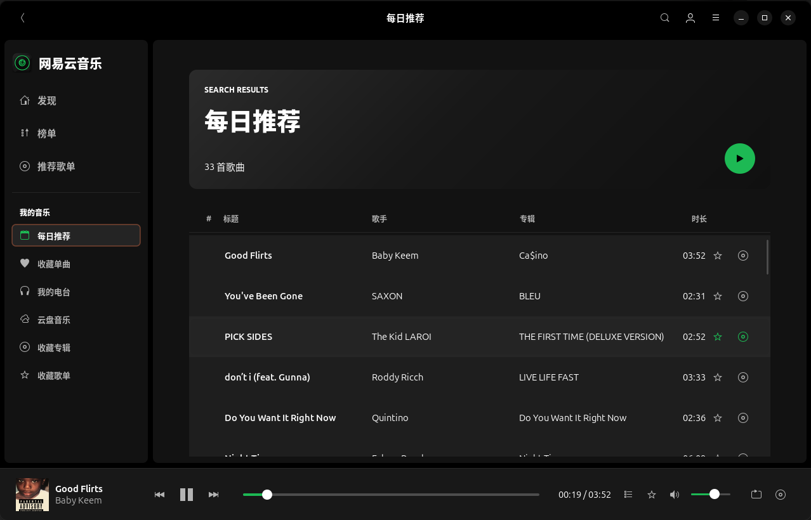
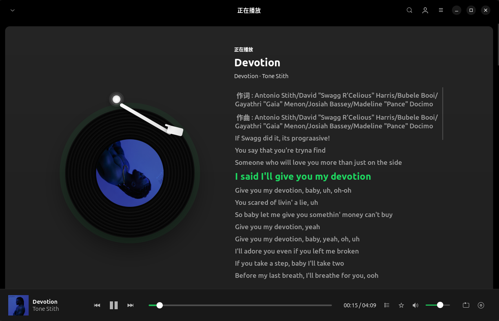
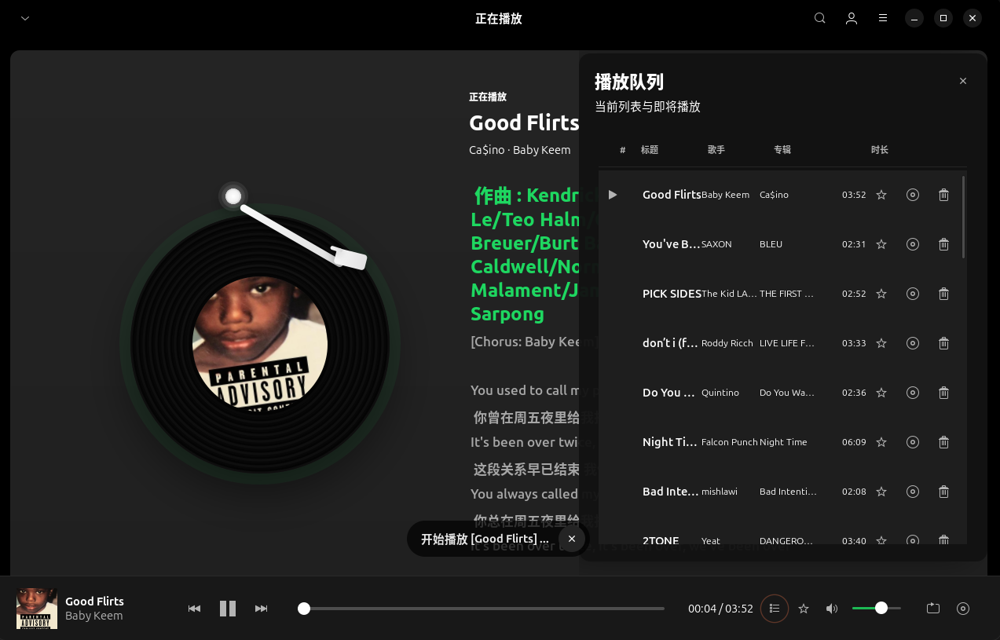
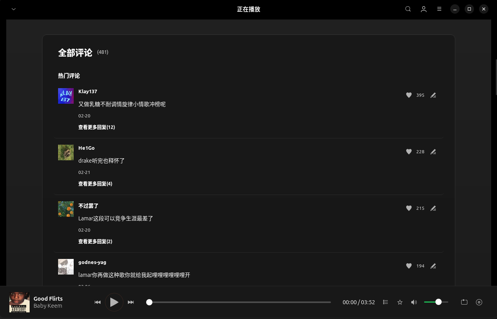

# NetEase Cloud Music Linux

基于 Rust、GTK4 和 libadwaita 的网易云音乐 Linux 桌面客户端。

基于原项目：https://github.com/gmg137/netease-cloud-music-gtk

## 主要特性

- 网易云音乐账号登录、歌单、专辑、榜单、搜索、每日推荐和收藏内容浏览
- 底部播放条、播放队列抽屉、循环模式、桌面媒体控制和 MPRIS 支持
- 全屏歌词详情页，包含唱片动画、歌词滚动、播放队列和歌曲评论区
- 歌曲评论加载、点赞、回复、删除和回复列表展示
- 大歌单和大播放队列分批渲染，减少大量歌曲一次性加载导致的卡顿
- 深色/浅色主题适配，自定义应用图标和整体视觉样式

## 安装

使用 Flatpak 安装

```bash
flatpak install flathub io.github.b1ngggg.netease_cloud_music_linux
```

## 本地构建
```bash
meson setup _build --prefix="$PWD/_run"
ninja -C _build
ninja -C _build install
```
## 界面展示










## 项目说明

NetEase Cloud Music Linux 是基于 NetEase Cloud Music Gtk 二开优化的网易云音乐 Linux 桌面客户端，重构了界面 UI，新增评论区，并包含播放队列、歌词页和大列表性能优化等改动。

本项目是非官方客户端。

原项目：https://github.com/gmg137/netease-cloud-music-gtk

## 许可证

本项目遵循 GNU General Public License v3.0 or later。详见 [LICENSE](LICENSE)。
